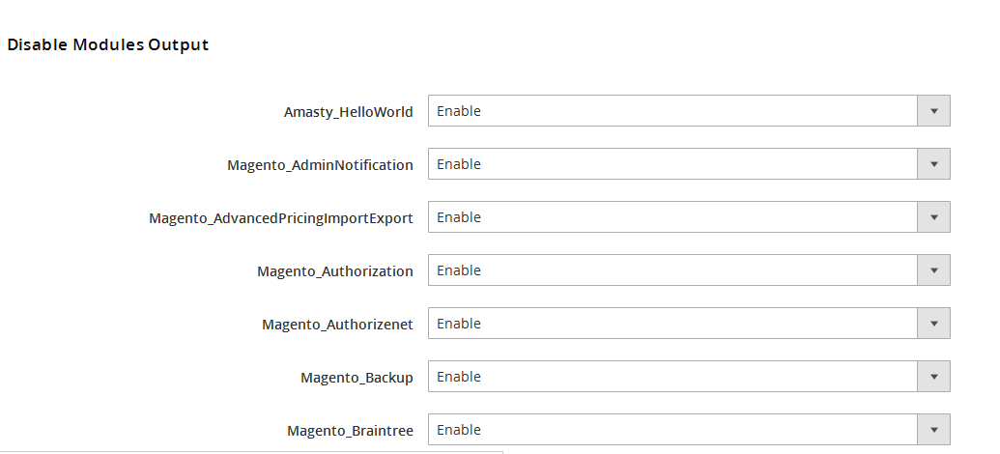
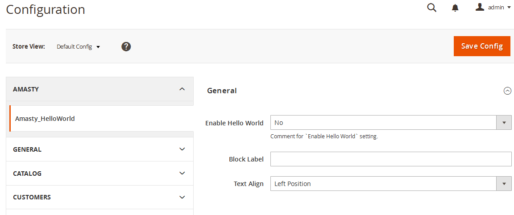
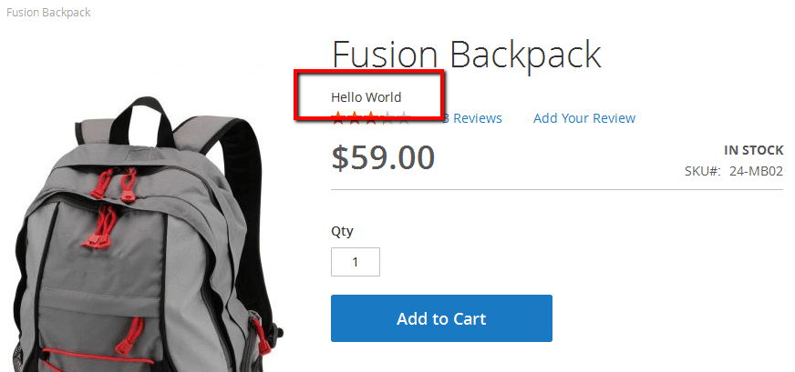
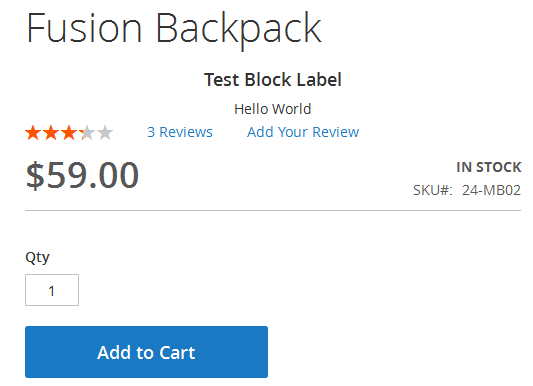
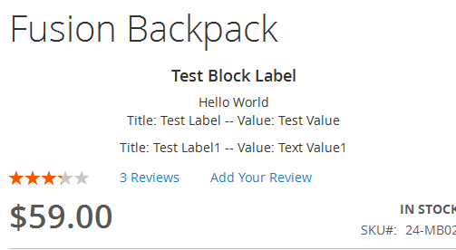

# Crear un modulo en magento

<p>This Magento 2 extension is going to have a model with undefined data, which will be stored in the database. And we'll display the values on the product page.</p>
<p>What's more, we are going to create several settings to change the extension's behavior. Nothing complicated, so let's start!</p>
<h2>Create configuration</h2>
<p>The first step is to install Magento 2 and create a catalog to store the extension files. In Magento 2 files are not distributed through the folders and have a modular structure.</p>
<p>The files of the newly created extension will be in this catalog:</p>

```app\code\Amasty\HelloWorld```

<p>Here Amasty is the name of the company that built the extension, HelloWorld is the name of the Magento 2 extension we are creating at the moment.</p>
<p>Now it's time to actually code the extension. Catalogs purposes have slightly changed in comparison with the first versions of Magento.</p>
<p>Extension configuration is located in <code>etc</code> folder, as before.</p>
<p>Let's create <code>app\code\Amasty\HelloWorld\etc</code> catalog and a <code>module.xml</code> file inside it. This is the file where we are going to set our extension name and its version.</p>
<p>The file looks like this:</p>

```xml
<?xml version="1.0"?>
<config xmlns:xsi="http://www.w3.org/2001/XMLSchema-instance" xsi:noNamespaceSchemaLocation="../../../../../lib/internal/Magento/Framework/Module/etc/module.xsd">
	<module name="Amasty_HelloWorld" setup_version="0.0.0">
	</module>
</config>
```
<p>Now let's check if Magento 2 sees the extension.</p>
<p>Run the following console command:</p>
<p><code>php bin/magento setup:upgrade</code></p>
<p>But there's no result. To fix it, let's create <code>registration.php</code> file in the root folder of the extension and put the following code inside:</p>

```php
/**
* @author Amasty Team
* @copyright Copyright (c) 2015 Amasty (http://www.amasty.com)
* @package Amasty_HelloWorld
*/
\Magento\Framework\Component\ComponentRegistrar::register(
	\Magento\Framework\Component\ComponentRegistrar::MODULE,
	'Amasty_HelloWorld',
	__DIR__
);
```

<p>This is done to tell Magento 2 that it should run the extension from the current directory.</p>
<p>Now go and clear Magento cache, and you'll see that our extension is working now:</p>
<p></p>

<h2>Create settings</h2>

<p>Now let's create some settings for the new extension. To do that, add <code>adminhtml</code> catalog to <code>etc </code>catalog. It will contain configuration files for backend.</p>
<p>The first file we need here is <code>routes.xml</code> for <code> frontName and id</code> setting, which is used to define queries for the extension. It is done by the following piece of code:</p>

```xml
<config xmlns:xsi="http://www.w3.org/2001/XMLSchema-instance" xsi:noNamespaceSchemaLocation="../../../../../../lib/internal/Magento/Framework/App/etc/routes.xsd">
	<router id="admin">
		<route id="amasty_helloworld" frontName="amasty_helloworld">
			<module name="Amasty_HelloWorld" />
		</route>
	</router>
</config>
```
<p>Now let's configure the extension settings. As in the previous version, they're located in the <code>system.xml</code> file, but the xml markup is slightly different in Magento 2.</p>

<p>I'm creating the three most popular settings as an example: a text setting, yes/no setting and a setting with custom values.</p>
<p>Have a look at the config file contents and what it actually means:</p>

```xml
<?xml version="1.0"?>
<config xmlns:xsi="http://www.w3.org/2001/XMLSchema-instance" xsi:noNamespaceSchemaLocation="../../../../Magento/Config/etc/system_file.xsd">
	<system>
		<tab id="amasty" translate="label" sortOrder="10">
			<label>Amasty</label>
		</tab>
		<section id="amasty_helloworld" translate="label" type="text" sortOrder="10" showInDefault="1" showInWebsite="1" showInStore="1">
			<label>Amasty_HelloWorld</label>
			<tab>amasty</tab>
			<resource>Amasty_HelloWorld::amasty_helloworld</resource>
			<group id="general" translate="label" type="text" sortOrder="10" showInDefault="1" showInWebsite="0" showInStore="0">
				<label>General</label>
				<field id="enable" translate="label comment" type="select" sortOrder="10" showInDefault="1" showInWebsite="1" showInStore="1">
					<label>Enable Hello World</label>
					<source_model>Magento\Config\Model\Config\Source\Yesno</source_model>
					<comment>
						Comment for 'Enable Hello World' setting.
					</comment>
				</field>
				<field id="block_label" translate="label" type="text" sortOrder="20" showInDefault="1" showInWebsite="1" showInStore="1">
					<label>Block Label</label>
				</field>
				<field id="text_align" translate="label" type="select" sortOrder="30" showInDefault="1" showInWebsite="1" showInStore="1">
					<label>Text Align</label>
					<source_model>Amasty\HelloWorld\Model\Source\Align</source_model>
				</field>
			</group>
		</section>
	</system>
</config>
```
<p>Add a new section to the settings block using ```<tab>```. Set the unique ID and the name of the settings section inside. It is done because we have a very high possibility of using several apps from the same vendor on a single site.</p>

<p>Add the new <code><section id="amasty_helloworld"></code> , again, with the unique ID, and set the necessary parameters, such as type, translation fields, order, label, the block for which the section is added, and so on. And then add the settings just inside the section. They will be divided into groups (one group in our case). The groups are defined by <code><group></code><strong>, </strong>and the fields are set by<code> <field></code><strong>. </strong> We have already created three settings and pointed out types, labels, visibility, translation, comments and the data model.</p>
<p>In our case the third setting implies custom data, so we pointed out a separate data model for it. To do that, you need to create <code>Amasty\HelloWorld\Model\Source\ Align</code> model, where we will set the needed choice variants. The extension should be defined from <code>\Magento\Framework\Option\ArrayInterface</code> interface, and you need to redefine <code>toOptionArray()</code> and <code>toArray()</code> methods as well.</p>
<p>To check what you are doing, go to the bottom of the article and subscribe to get the code of the whole extension.</p>
<p>Let's check the result. Open your Magento 2 backend, go to <code>Stores – Configuration</code>. Boom, we can see the settings!</p>

<p>Now, as we created the settings, we should set default values for the options. To do that, create a <code>config.xml</code> in the <code>etc</code> catalog and put the default values in accordance with <code>system.xml</code> in there.</p>
<h2>Frontend output</h2>
<h3>Block</h3>
<p>Now let's try to show something on the frontend, i.e. to create a block and a template for it, and then to show this block on the product page.</p>
<p>Create a class of<code> \Amasty\HelloWorld\Block\Catalog\Product\HelloWorld</code> block, which should inherit from Magento class <code>\Magento\Framework\View\Element\Template</code></p>
<p>We are going to use the parent constructor. Here's how it will look like for this block:</p>

```php
public function __construct(\Magento\Framework\View\Element\Template\Context $context,array $data = []) {
	parent::__construct($context, $data);
}
```
<h3>Template</h3>
<p>Let's create a simple template and put it in the following catalog:</p>
<p><code>Amasty\HelloWorld\view\frontend\templates\product\hello.phtml</code></p>
<p>You can see that in Magento 2 we have the <code>view</code> catalog, where we're going to store the information, which was scattered in several theme catalogs, such as templates, layouts, scripts, styles, before.</p>
<p>Put this simple text inside:</p>
<p><code><?=__('Hello World');?></code></p>
<p>As we see from the example, now you can perform translation in Magento using<code> __()</code> without a separate class. And the translation for this line will be pulled from <code>Amasty\HelloWorld\i18n\en_US.csv</code></p>
<p>We have created the template, now let's show it on the product page.</p>
<h3>Layout</h3>
<p>Time to create the layout! Now we are creating not a unique layout for all the pages, but a separate file for each page. As we will show the block on the product page, let's create a layout with the following name:<br>
<code>Amasty\HelloWorld\view\frontend\layout\catalog_product_view.xml</code><br>
Put this code inside:</p>

```xml
<page xmlns:xsi="http://www.w3.org/2001/XMLSchema-instance" xsi:noNamespaceSchemaLocation="urn:magento:framework:View/Layout/etc/page_configuration.xsd">
	<head>
		<css src="Amasty_HelloWorld/css/hello.css"/>
	</head>
	<body>
		<referenceContainer name="product.info.main">
			<block name="amasty_helloworld.helloworld" class="Amasty\HelloWorld\Block\Catalog\Product\HelloWorld" before="-" template="product/hello.phtml" />
		</referenceContainer>
	</body>
</page>
```
<p>As an example, we added the new block into <code>product.info.main</code> block in the layout code and added the styles file to use when showing on frontend. The styles file has the following address:</p>
<p><code>Amasty\HelloWorld\view\frontend\web\css\hello.css</code></p>
<p>Refresh the product page:</p>

<p>Voila, the block is there!</p>
<p>Now let's change the look of the block – and add the helper initialization to it.</p>
<p>The extension constructor looks like this:</p>

```php
/**
* @var \Amasty\HelloWorld\Helper\Data
*/
protected $_helper;

public function __construct(\Magento\Framework\View\Element\Template\Context $context,array $data = [],\Amasty\HelloWorld\Helper\Data $helper) {
	
	parent::__construct($context, $data);

	$this->_helper = $helper;
}
```

<p>The helper from the created block is used as <code>$this->_helper</code> variable.</p>
<h3>Helper</h3>
<p>Create the helper in the following catalog:</p>
<p><code>Amasty\HelloWorld\Helper\Data.php</code></p>
<p>Add <code>\Magento\Framework\App\Config\ScopeConfigInterface</code> interface object initialization to the helper, it works to receive the data from configuration.</p>
<p>Now the file looks like this:</p>

```php
namespace Amasty\HelloWorld\Helper; 

class Data extends \Magento\Framework\App\Helper\AbstractHelper {
	
	/**
	 * @var \Magento\Framework\App\Config\ScopeConfigInterfac
	 */
	protected $_scopeConfig; 
	
	CONST ENABLE = 'amasty_helloworld/general/enable';
	CONST BLOCK_LABEL = 'amasty_helloworld/general/block_label';
	CONST TEXT_ALIGN = 'amasty_helloworld/general/text_align'; 

	public function __construct(\Magento\Framework\App\Helper\Context $context, \Magento\Framework\App\Config\ScopeConfigInterface $scopeConfig ) {

		parent::__construct($context); $this->_scopeConfig = $scopeConfig;
	}

	public function getEnable(){
		return $this->_scopeConfig->getValue(self::ENABLE);
	}

	public function getBlockLabel(){
		return $this->_scopeConfig->getValue(self::BLOCK_LABEL);
	}

	public function getTextAlign(){
		return $this->_scopeConfig->getValue(self::TEXT_ALIGN);
	}
}
```
<p>In this piece of code you can see that three functions for getting extension configuration from settings section were created.</p>
<p>Let's use these functions in the block and change the template:</p>

```
<div class="amasty-helloworld-block" style="text-align: <?= $this->getTextAlign()?>"></p>
<h3 class="label"><?= $this->getBlockLabel()?></h3>
<?=__('Hello World');?>
</div>
```
<p>Now the block is displayed taking the settings into account:</p>
<p></p>
<h2>Model creation</h2>
<h3>Create installation script</h3>
<p>As in the 1.x versions of Magento, you need to create the installation file to use your own table. We are going to describe creating of a simple table with several fields. The file should be created here: <code>Amasty\HelloWorld\Setup\InstallSchema.php</code></p>
<p>And this is its contents:</p>

```php
public function install(SchemaSetupInterface $setup, ModuleContextInterface $context){
	$installer = $setup;
	$installer->startSetup();

	$table = $installer->getConnection()
	->newTable($installer->getTable('amasty_helloworld'))
	->addColumn(
		'id',
		\Magento\Framework\DB\Ddl\Table::TYPE_INTEGER,
		null,
		['identity' => true, 'unsigned' => true, 'nullable' => false, 'primary' => true],
		'Id'
	)
	->addColumn(
		'label',
		\Magento\Framework\DB\Ddl\Table::TYPE_TEXT,
		null,
		['default' => null, 'nullable' => false],
		'Name'
	)
	->addColumn(
		'value',
		\Magento\Framework\DB\Ddl\Table::TYPE_TEXT,
		null,
		['default' => null, 'nullable' => false],
		'Stores'
	);

	$installer->getConnection()->createTable($table);
	$installer->endSetup();
}
```

<p>You can see that we are creating an <code>amasty_helloworld</code> table with one field of integer type and two fields of text type.</p>
<h3>Model creation</h3>
<p>As in the previous Magento version, we need to create three classes to work with the model: the model itself, the resource model and the collection.</p>
<p>Let's create a <code>Amasty\HelloWorld\Model\HelloWorld.php</code> file and use the following initialization:</p>

```php
namespace Amasty\HelloWorld\Model\ResourceModel;

class HelloWorld extends \Magento\Framework\Model\ResourceModel\Db\AbstractDb{
	
	/**
	* Model Initialization
	*
	* @return void
	*/
	protected function _construct(){
		$this->_init('amasty_helloworld', 'id');
	}
}
```

<p>We just set the constructor for the model here. In fact, there is no great difference from the first Magento versions on this step. The resource model and the collection are stored in the following catalogs:</p>
<p><code>Amasty\HelloWorld\Model\ResourceModel\HelloWorld.php</code></p>
<p><code>Amasty\HelloWorld\Model\ResourceModel\HelloWorld\Collection.php</code></p>
<p>These files' listings are of no particular interest. Create a simple function in the block we're working with:</p>

```php
public function getCollection(){
	$model = $this->_objectManager->create('Amasty\HelloWorld\Model\HelloWorld');

	$collection = $model->getCollection();

	return $collection;
}
```
<p>and display it inside the template:</p>

```php

	foreach($this->getCollection() as $item){
		echo "<p><label>".__("Title: ") . $item->getLabel()."</label> — <label>".__("Value: ") . $item->getValue()."</label></p>";
	}
```
<p>Now update the product page: it works!</p>


